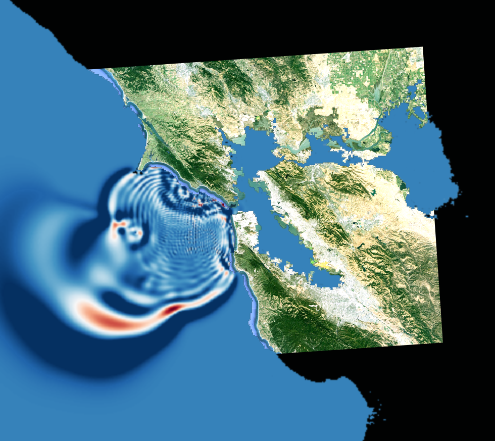

# nidhoggr




```

     _   _ _
 ___|_|_| | |_ ___ ___ ___ ___
|   | | . |   | . | . | . |  _|
|_|_|_|___|_|_|___|_  |_  |_|
      v0.7.7      |___|___|

git clone --recurse-submodules https://github.com/your-username/nidhoggr.git
git submodule update --remote --recursive


mkdir build

Nidhoggr/
|-- exmaples/
|-- src/
|   |-- Math/
|   |   |-- vectorMath.cc
|   |   |-- vectorMath.py
|   |   |-- ...
|   |-- ...
|-- tests/
|-- build/

inside build directory->
cmake ..
make

```

Hopefully you already have python somewhere...
You may need to pip3 install PYB11Generator

Consult the Classes.md files in src subdirectories for interface guides.

Note: Nidhoggr uses a forked version of PYB11Generator pinned to a patch branch that fixes enum tuple support.