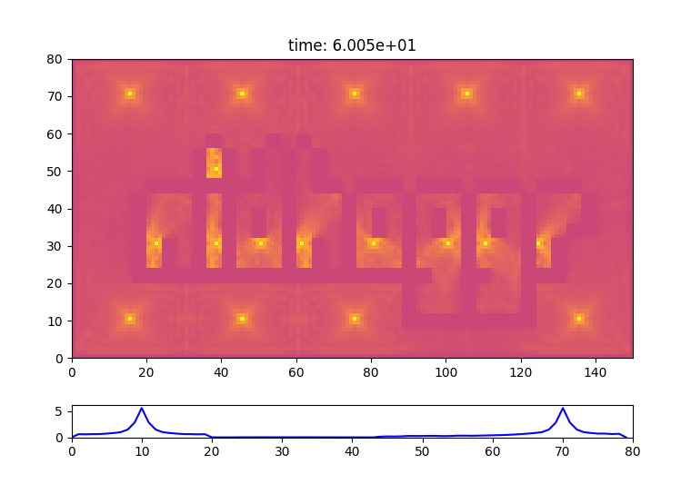

  

# nidhoggr

Nidhoggr is a generic physics simulation framework. It is designed to be used as a base for varied physics simulation methods (FVM,FEM,etc)
while keeping helper methods likes equations of state and integrators generic enough to be portable to a wide variety of 
methods choices. Nidhoggr's major classes and methods are written in C++ and wrapped in Python using pybind11 to enable them to be imported
as python modules inside a runscript. Python holds and passes the pointers to most objects inside the code, while the integration step is
always handled by compiled C++ code.

*An example Schroedinger wave solve with Dirichlet boundary conditions*

Nidhoggr's integrators expect assigned (derived) physics classes to override the physics base class methods for PrestepInitialize, EvaluateDerivatives and FinalizeStep. The order in which you assign these physics objects to the integrator is the order in which they will be computed (*operator splitting*). Consult the Classes.md files in src subdirectories for interface guides on many of the classes and methods.

Basic documentation is available at [ReadTheDocs](https://nidhoggr.readthedocs.io).
